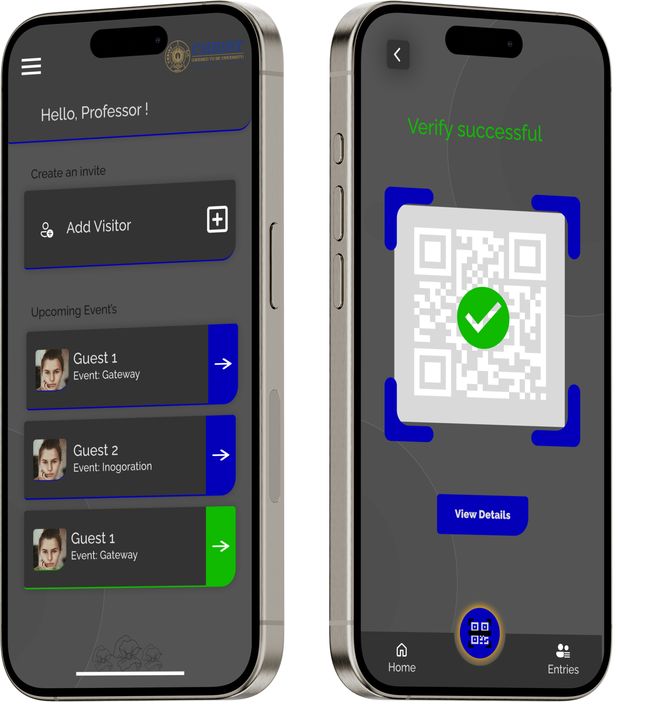
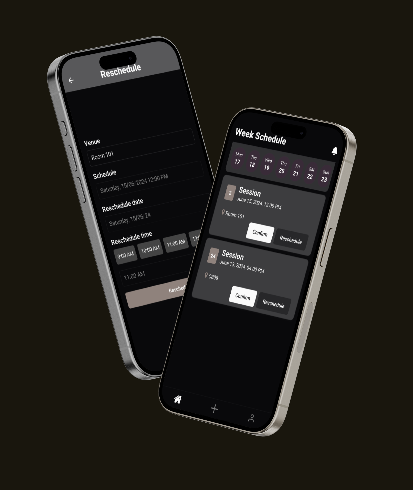
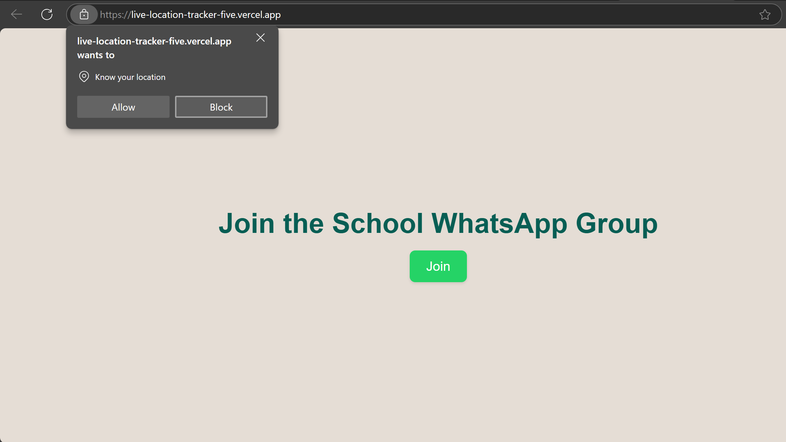

<!-- profile view count -->

  

 
<!-- about me -->

  Hi, I'm S Alankritha, Front-End Developer/UI/UX Designer 💻 & JavaScript Enthusiast!
   
   
  🎓 Currently a Masters student.
   
  💻 I love to learn new technologies and frameworks.
   
  🧑‍💼 I’m currently working on CI/CD Projects.

<!-- skills -->
<h2 align="center">🔥 Languages-Frameworks-Tools 🔥</h2>
 

  <a href="https://skillicons.dev">
      <!-- first row -->
      <picture>
          <source media="(prefers-color-scheme: dark)" srcset="https://skillicons.dev/icons?i=nextjs%2Creact%2Cgit%2Chtml%2Ccss%2Cjavascript%2Cts%2Ctailwind%2Cfigma%2Cthreejs&theme=dark" />
<source media="(prefers-color-scheme: light), (prefers-color-scheme: no-preference)" srcset="https://skillicons.dev/icons?i=nextjs%2Creact%2Cgit%2Chtml%2Ccss%2Cjavascript%2Cts%2Ctailwind%2Cfigma%2Cthreejs&theme=light" />
          
        </picture>
           
          <!-- second row -->
          <picture>
            <source media="(prefers-color-scheme: dark)" srcset="https://skillicons.dev/icons?i=nodejs%2Cexpress%2Cmongodb%2Cmysql%2Cpostgres%2Credux%2Cprisma%2Cfirebase%2Csupabase&theme=dark" />
            <source media="(prefers-color-scheme: light), (prefers-color-scheme: no-preference)" srcset="https://skillicons.dev/icons?i=nodejs%2Cexpress%2Cmongodb%2Cmysql%2Cpostgres%2Credux%2Cprisma%2Cfirebase%2Csupabase&theme=light" />
            
        </picture>

  </a>

 

<!-- snake graph -->

  <h2>🐍 Snake eating someone's contribution 🐍</h2>
   
  <picture>
    <source media="(prefers-color-scheme: dark)" srcset="github-contribution-grid-snake-dark.svg" />
    <source media="(prefers-color-scheme: light), (prefers-color-scheme: no-preference)" srcset="github-contribution-grid-snake.svg" />
    
  </picture>
   
   
   

<!-- repositories -->
<h2 align="center">👨‍💻 Repositories 👨‍💻</h2>
 
<!-- first row -->

  <!-- repo 1 -->
  

    <a href="https://github.com/AlankrithaS/CU-MyGate" title="CU MyGate">
      <picture>
        <source media="(prefers-color-scheme: dark)" srcset="https://github-readme-stats.vercel.app/api/pin/?username=AlankrithaS&repo=CU-MyGate&theme=react&border_color=2C8C83&border_radius=10" />
        <source media="(prefers-color-scheme: light), (prefers-color-scheme: no-preference)" srcset="https://github-readme-stats.vercel.app/api/pin/?username=AlankrithaS&repo=CU-MyGate&theme=graywhite&border_color=2C8C83&border_radius=10" />
        
      </picture>
    </a>
    
University Mobile App revolutionizes the Visitor Authorization Platform, optimizing coordination mechanisms.

  

  <!-- repo 2 -->

  <a href="https://github.com/AlankrithaS/connect-mentee" title="Connect Mentee">
    <picture>
      <source media="(prefers-color-scheme: dark)" srcset="https://github-readme-stats.vercel.app/api/pin/?username=AlankrithaS&repo=connect-mentee&theme=react&border_color=2C8C83&border_radius=10" />
      <source media="(prefers-color-scheme: light), (prefers-color-scheme: no-preference)" srcset="https://github-readme-stats.vercel.app/api/pin/?username=AlankrithaS&repo=connect-mentee&theme=graywhite&border_color=2C8C83&border_radius=10" />
      
    </picture>
  </a>
  
University mobile app revolutionizes mentee-mentor allocation, optimizing coordination.

<!-- repo 3 -->

  <a href="https://github.com/AlankrithaS/discord-bot-jda" title="Capture the Flag">
    <picture>
      <source media="(prefers-color-scheme: dark)" srcset="https://github-readme-stats.vercel.app/api/pin/?username=AlankrithaS&repo=discord-bot-jda&theme=react&border_color=2C8C83&border_radius=10" />
      <source media="(prefers-color-scheme: light), (prefers-color-scheme: no-preference)" srcset="https://github-readme-stats.vercel.app/api/pin/?username=AlankrithaS&repo=discord-bot-jda&theme=graywhite&border_color=2C8C83&border_radius=10" />
      
    </picture>
  </a>
  
Discord bot using JDA monitors user activity, enforces rules with ban actions & offers slash commands.

  <!-- repo 4 -->
  

    <a href="https://github.com/AlankrithaS/live_location_tracker" title="Geo Master">
      <picture>
        <source media="(prefers-color-scheme: dark)" srcset="https://github-readme-stats.vercel.app/api/pin/?username=AlankrithaS&repo=live_location_tracker&theme=react&border_color=2C8C83&border_radius=10" />
        <source media="(prefers-color-scheme: light), (prefers-color-scheme: no-preference)" srcset="https://github-readme-stats.vercel.app/api/pin/?username=AlankrithaS&repo=live_location_tracker&theme=graywhite&border_color=2C8C83&border_radius=10" />
        
      </picture>
    </a>
    
Developed a live location tracking web app,featuring real-time geolocation data storage & an intuitive WhatsApp-like interface.

  

<!-- spaces -->

      

<!-- show more repos -->
<h4 align="center">
  <a href="https://github.com/AlankrithaS" title="Show Repositories" style="color:#2C8C83; font-weight:bold; transition: all 0.3s ease;" onmouseover="this.style.transform='scale(1.05)';" onmouseout="this.style.transform='scale(1)'">🔎 Show More 🔍</a>
</h4>